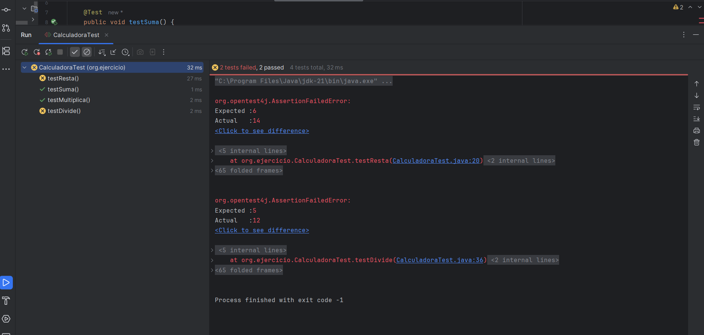

# CalculadoraTest — Pruebas Unitarias con JUnit 5

Proyecto práctico sobre pruebas unitarias en Java utilizando JUnit 5. Se trabaja sobre una clase `Calculadora` que contiene errores introducidos intencionadamente, con el objetivo de aprender a detectarlos, analizarlos y corregirlos mediante tests automatizados. El proyecto progresa desde tests básicos hasta técnicas avanzadas como parametrización y suites de pruebas.

---

## Índice

- [Ejercicio 1 — Tests básicos y detección de errores](#ejercicio-1)
- [Ejercicio 2 — Diferencia entre fallo y error](#ejercicio-2)
- [Ejercicio 3 — Ciclo de vida con @BeforeEach y @AfterEach](#ejercicio-3)
- [Ejercicio 4 — Tests parametrizados](#ejercicio-4)
- [Ejercicio 5 — Suite de pruebas](#ejercicio-5)
- [Ejercicio 6 — Reflexión y pirámide de testing](#ejercicio-6)

---

## Ejercicio 1

> _Crear una clase de pruebas `CalculadoraMPLTest` que verifique los cuatro métodos de la clase `Calculadora`: `suma()`, `resta()`, `multiplica()` y `divide()`. Los métodos `resta()` y `divide()` contienen errores intencionados que los tests deben detectar. Una vez detectados, corregir la clase y volver a pasar los tests hasta obtener todos en verde._

**Por qué es importante**  
Este ejercicio introduce el ciclo básico del testing: escribir un test, detectar un fallo, corregir el código y verificar. En un entorno profesional, este proceso evita que errores lleguen a producción y permite localizar exactamente dónde falla el código sin revisar el programa completo.

**Pasos realizados**

1. Creación de `CalculadoraMPLTest.java` en `src/test/java/org/ejercicio/`
2. Implementación de los 4 tests con `assertEquals`
3. Ejecución → `testResta` y `testDivide` fallan: los métodos están usando `+` en vez de `-` y `/`
4. Corrección de `Calculadora.java`
5. Segunda ejecución → 4 tests en verde

**Código — CalculadoraMPLTest.java**
<details>
<summary>Ver el código completo</summary>
  
```java
package org.ejercicio;

import org.junit.jupiter.api.Test;
import static org.junit.jupiter.api.Assertions.*;

public class CalculadoraMPLTest {

    @Test
    public void testSuma() {
        Calculadora calc = new Calculadora(3, 5);
        assertEquals(8, calc.suma());
    }

    @Test
    public void testResta() {
        Calculadora calc = new Calculadora(10, 4);
        assertEquals(6, calc.resta());
    }

    @Test
    public void testMultiplica() {
        Calculadora calc = new Calculadora(3, 4);
        assertEquals(12, calc.multiplica());
    }

    @Test
    public void testDivide() {
        Calculadora calc = new Calculadora(10, 2);
        assertEquals(5, calc.divide());
    }
}
```
</details>


**Resultado — Tests fallando (errores detectados)**  


**Resultado — Tests corregidos**  


---

## Ejercicio 2

> _Aprender a distinguir entre fallo y error en JUnit. Reescribir `divide()` para que lance una excepción cuando el divisor es 0, y crear un test que verifique que esa excepción se lanza correctamente._

**Por qué es importante**  
En testing es fundamental distinguir entre un **fallo** (el programa se ejecuta pero devuelve un resultado incorrecto) y un **error** (el programa se detiene porque se produce una excepción). Saber verificar que las excepciones se lanzan correctamente es una habilidad esencial para garantizar que el código se comporta de forma segura ante datos incorrectos.

**Pasos realizados**

1. Modificación de `divide()` en `Calculadora.java` para lanzar `ArithmeticException` si el divisor es 0
2. Modificación de `testDivide()` para usar valores sin riesgo de división por 0
3. Creación de `testDivideExcepcion()` que verifica que la excepción se lanza correctamente
4. Ejecución → 5 tests en verde
5. Forzado de fallo cambiando el mensaje esperado → JUnit detecta la discrepancia
6. Corrección y ejecución final → 5 tests en verde

**Código — Calculadora.java (método divide)**

<details>
<summary>Ver el código completo</summary>
  
```java
public int divide() {
    if (segundoNumero == 0) {
        throw new ArithmeticException("División por 0");
    } else {
        int resultado = primerNumero / segundoNumero;
        return resultado;
    }
}
```
</details>

**Código — CalculadoraMPLTest.java (tests añadidos)**

<details>
<summary>Ver el código completo</summary>
  
```java
@Test
public void testDivide() {
    Calculadora calc = new Calculadora(30, 10);
    int valorEsperado = 3;
    int valorObtenido = calc.divide();
    assertEquals(valorEsperado, valorObtenido);
}

@Test
public void testDivideExcepcion() {
    Calculadora calc = new Calculadora(30, 0);
    String valorEsperado = "División por 0";
    String valorDevuelto = "";
    try {
        calc.divide();
    } catch (ArithmeticException e) {
        valorDevuelto = e.getMessage();
    }
    assertEquals(valorEsperado, valorDevuelto);
}

```
</details>

**Resultado — Fallo forzado**  


**Resultado — 5 tests en verde**  


---

## Ejercicio 3

*(pendiente)*

---

## Ejercicio 4

*(pendiente)*

---

## Ejercicio 5

*(pendiente)*

---

## Ejercicio 6

*(pendiente)*

---

## Tecnologías

- Java 21
- JUnit 5
- Maven
- IntelliJ IDEA


**1º DAW – Entornos de Desarrollo | IES Mutxamel | Curso 2025/2026**  
**Autora:** Manuela Planelles Lucas
