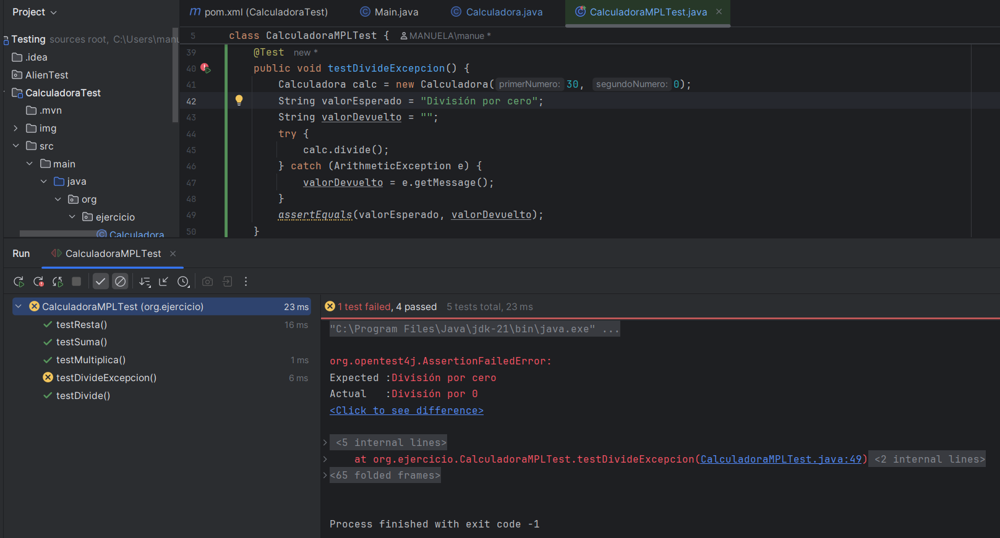
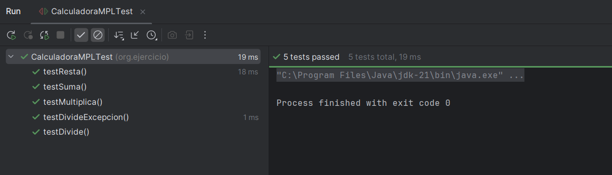
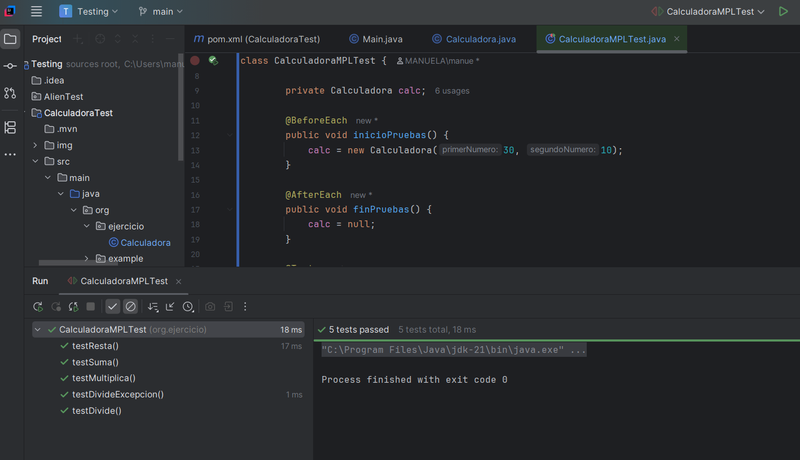
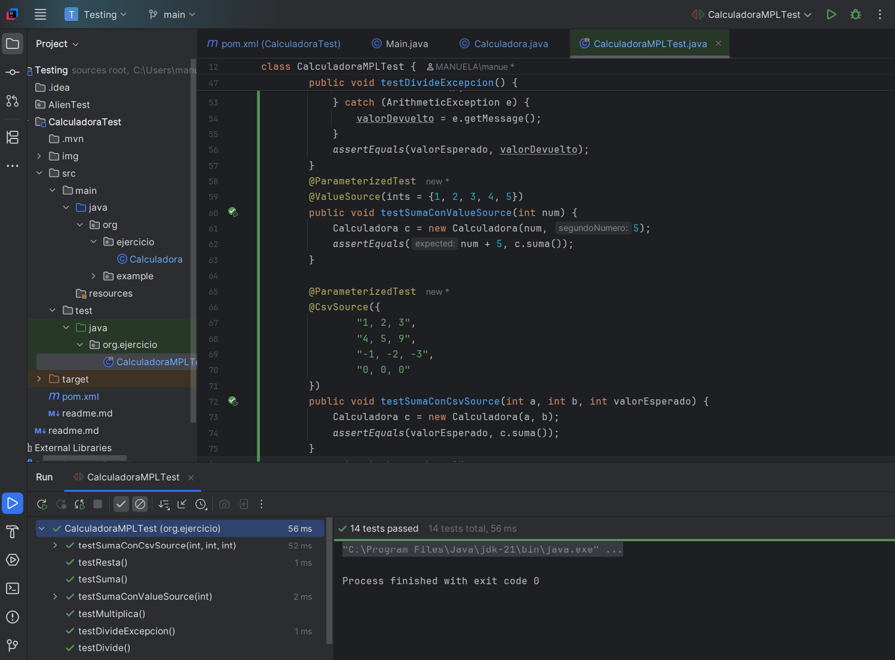
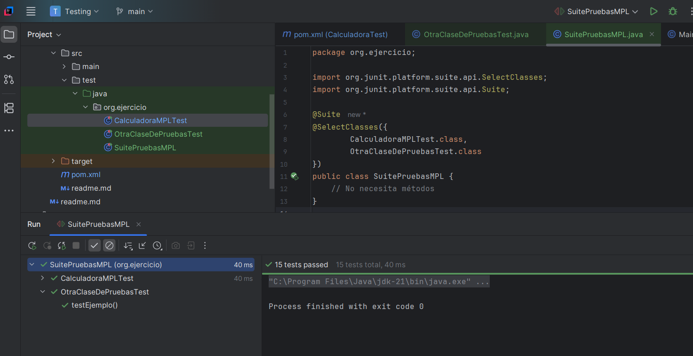
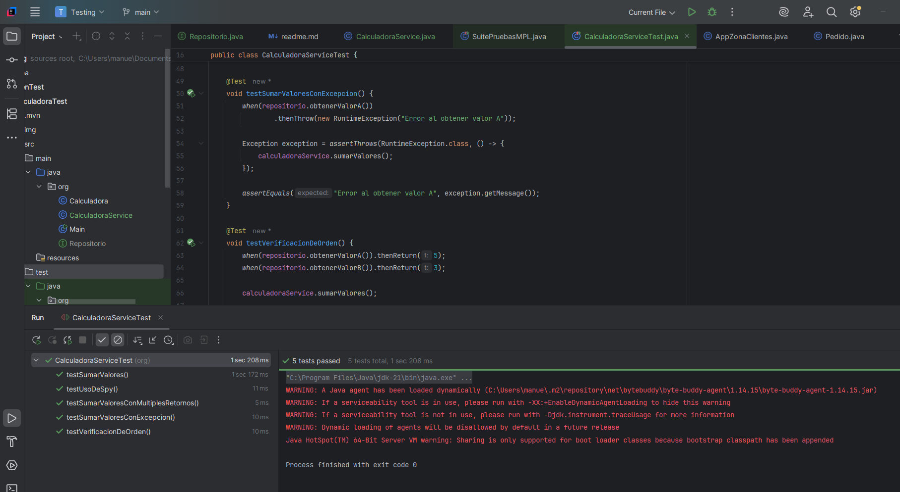

# CalculadoraTest — Pruebas Unitarias con JUnit 5

Proyecto práctico sobre pruebas unitarias en Java utilizando JUnit 5. Se trabaja sobre una clase `Calculadora` que contiene errores introducidos intencionadamente, con el objetivo de aprender a detectarlos, analizarlos y corregirlos mediante tests automatizados. El proyecto progresa desde tests básicos hasta técnicas avanzadas como parametrización y suites de pruebas.

## Índice

- [Ejercicio 1 — Tests básicos y detección de errores](#ejercicio-1)
- [Ejercicio 2 — Diferencia entre fallo y error](#ejercicio-2)
- [Ejercicio 3 — Ciclo de vida con @BeforeEach y @AfterEach](#ejercicio-3)
- [Ejercicio 4 — Tests parametrizados](#ejercicio-4)
- [Ejercicio 5 — Suite de pruebas](#ejercicio-5)
- [Ejercicio 6 — Reflexión y pirámide de testing](#ejercicio-6)
- [Mockito — Pruebas de Integración](#mockito--pruebas-de-integración)

---

## Ejercicio 1

> _Crear una clase de pruebas `CalculadoraMPLTest` que verifique los cuatro métodos de la clase `Calculadora`: `suma()`, `resta()`, `multiplica()` y `divide()`. Los métodos `resta()` y `divide()` contienen errores intencionados que los tests deben detectar. Una vez detectados, corregir la clase y volver a pasar los tests hasta obtener todos en verde._
  
Este ejercicio introduce el ciclo básico del testing: escribir un test, detectar un fallo, corregir el código y verificar. En un entorno profesional, este proceso evita que errores lleguen a producción y permite localizar exactamente dónde falla el código sin revisar el programa completo.

**Pasos realizados**

1. Creación de `CalculadoraMPLTest.java` en `src/test/java/org/ejercicio/`
2. Implementación de los 4 tests con `assertEquals`
3. Ejecución → `testResta` y `testDivide` fallan: los métodos están usando `+` en vez de `-` y `/`
4. Corrección de `Calculadora.java`
5. Segunda ejecución → 4 tests en verde

**Código — CalculadoraMPLTest.java**
<details>
<summary>Ver el código completo</summary>

```java
package org.ejercicio;

import org.Calculadora;
import org.junit.jupiter.api.Test;

import static org.junit.jupiter.api.Assertions.*;

public class CalculadoraMPLTest {

    @Test
    public void testSuma() {
        Calculadora calc = new Calculadora(3, 5);
        assertEquals(8, calc.suma());
    }

    @Test
    public void testResta() {
        Calculadora calc = new Calculadora(10, 4);
        assertEquals(6, calc.resta());
    }

    @Test
    public void testMultiplica() {
        Calculadora calc = new Calculadora(3, 4);
        assertEquals(12, calc.multiplica());
    }

    @Test
    public void testDivide() {
        Calculadora calc = new Calculadora(10, 2);
        assertEquals(5, calc.divide());
    }
}
```
</details>


**Resultado — Tests fallando (errores detectados)**  


**Resultado — Tests corregidos**  


---

## Ejercicio 2

> _Aprender a distinguir entre fallo y error en JUnit. Reescribir `divide()` para que lance una excepción cuando el divisor es 0, y crear un test que verifique que esa excepción se lanza correctamente._

En testing es fundamental distinguir entre un **fallo** (el programa se ejecuta pero devuelve un resultado incorrecto) y un **error** (el programa se detiene porque se produce una excepción). Saber verificar que las excepciones se lanzan correctamente es una habilidad esencial para garantizar que el código se comporta de forma segura ante datos incorrectos.

**Pasos realizados**

1. Modificación de `divide()` en `Calculadora.java` para lanzar `ArithmeticException` si el divisor es 0
2. Modificación de `testDivide()` para usar valores sin riesgo de división por 0
3. Creación de `testDivideExcepcion()` que verifica que la excepción se lanza correctamente
4. Ejecución → 5 tests en verde
5. Forzado de fallo cambiando el mensaje esperado → JUnit detecta la discrepancia
6. Corrección y ejecución final → 5 tests en verde

**Código — Calculadora.java (método divide)**

<details>
<summary>Ver el código completo</summary>
  
```java
public int divide() {
    if (segundoNumero == 0) {
        throw new ArithmeticException("División por 0");
    } else {
        int resultado = primerNumero / segundoNumero;
        return resultado;
    }
}
```
</details>

**Código — CalculadoraMPLTest.java (tests añadidos)**

<details>
<summary>Ver el código completo</summary>
  
```java
@Test
public void testDivide() {
    Calculadora calc = new Calculadora(30, 10);
    int valorEsperado = 3;
    int valorObtenido = calc.divide();
    assertEquals(valorEsperado, valorObtenido);
}

@Test
public void testDivideExcepcion() {
    Calculadora calc = new Calculadora(30, 0);
    String valorEsperado = "División por 0";
    String valorDevuelto = "";
    try {
        calc.divide();
    } catch (ArithmeticException e) {
        valorDevuelto = e.getMessage();
    }
    assertEquals(valorEsperado, valorDevuelto);
}

```
</details>

**Resultado — Fallo forzado**  


**Resultado — 5 tests en verde**  


---

## Ejercicio 3

> _Modificar la clase de pruebas para usar `@BeforeEach` y `@AfterEach`, eliminando la creación repetida del objeto `Calculadora` dentro de cada test._

En proyectos reales los tests comparten recursos: conexiones a bases de datos, objetos complejos, ficheros. Repetir la inicialización en cada test es código duplicado y difícil de mantener. `@BeforeEach` y `@AfterEach` permiten centralizar esa lógica, haciendo los tests más limpios y fáciles de modificar.

**Pasos realizados**

1. Declaración de `calc` como atributo privado de la clase
2. Creación de `inicioPruebas()` con `@BeforeEach` — se ejecuta antes de cada test
3. Creación de `finPruebas()` con `@AfterEach` — libera el objeto al terminar cada test
4. Eliminación de `new Calculadora` dentro de cada test
5. `testDivideExcepcion()` mantiene su propio objeto `calcCero` ya que necesita divisor 0
6. Ejecución → 5 tests en verde

**Código — CalculadoraMPLTest.java**

<details>
<summary>Ver el código completo</summary>

```java
package org.ejercicio;

import org.Calculadora;
import org.junit.jupiter.api.AfterEach;
import org.junit.jupiter.api.BeforeEach;
import org.junit.jupiter.api.Test;

import static org.junit.jupiter.api.Assertions.*;

public class CalculadoraMPLTest {

    private Calculadora calc;

    @BeforeEach
    public void inicioPruebas() {
        calc = new Calculadora(30, 10);
    }

    @AfterEach
    public void finPruebas() {
        calc = null;
    }

    @Test
    public void testSuma() {
        assertEquals(40, calc.suma());
    }

    @Test
    public void testResta() {
        assertEquals(20, calc.resta());
    }

    @Test
    public void testMultiplica() {
        assertEquals(300, calc.multiplica());
    }

    @Test
    public void testDivide() {
        assertEquals(3, calc.divide());
    }

    @Test
    public void testDivideExcepcion() {
        Calculadora calcCero = new Calculadora(30, 0);
        String valorEsperado = "División por 0";
        String valorDevuelto = "";
        try {
            calcCero.divide();
        } catch (ArithmeticException e) {
            valorDevuelto = e.getMessage();
        }
        assertEquals(valorEsperado, valorDevuelto);
    }
}
```
</details>

**Resultado — 5 tests en verde**  


---

## Ejercicio 4

> _Crear tests parametrizados para los métodos de la clase `Calculadora` utilizando `@ValueSource` y `@CsvSource`._
 
En testing profesional es habitual probar el mismo método con múltiples combinaciones de datos. Repetir un test por cada combinación genera código duplicado y difícil de mantener. Los tests parametrizados permiten definir los datos por separado y ejecutar el mismo test automáticamente para cada caso, reduciendo código y aumentando la cobertura.

**Pasos realizados**

1. Añadida dependencia `junit-jupiter-params` en `pom.xml`
2. Creación de `testSumaConValueSource()` con `@ValueSource` — ejecuta el test con 5 valores distintos
3. Creación de `testSumaConCsvSource()` con `@CsvSource` — ejecuta el test con 4 combinaciones de entrada y resultado esperado
4. Ejecución → todos los subtests en verde

**Código — tests añadidos**

<details>
<summary>Ver el código completo</summary>
  
```java
@ParameterizedTest
@ValueSource(ints = {1, 2, 3, 4, 5})
public void testSumaConValueSource(int num) {
    Calculadora c = new Calculadora(num, 5);
    assertEquals(num + 5, c.suma());
}

@ParameterizedTest
@CsvSource({
    "1, 2, 3",
    "4, 5, 9",
    "-1, -2, -3",
    "0, 0, 0"
})
public void testSumaConCsvSource(int a, int b, int valorEsperado) {
    Calculadora c = new Calculadora(a, b);
    assertEquals(valorEsperado, c.suma());
}
```
</details>

**Resultado — tests parametrizados en verde**  


---

## Ejercicio 5

> _Crear una Suite de pruebas que agrupe `CalculadoraMPLTest` y `OtraClaseDePruebasTest` y las ejecute juntas en un solo paso._

En proyectos reales hay múltiples clases con sus propios tests. Ejecutarlos uno a uno no es eficiente. Una Suite permite lanzar todos los tests del proyecto de un solo clic, lo que resulta especialmente útil en procesos de integración continua donde se necesita verificar el estado completo del sistema tras cada cambio en el código.

**Pasos realizados**

1. Añadidas dependencias `junit-platform-suite-api` y `junit-platform-suite-engine` en `pom.xml`
2. Creación de `OtraClaseDePruebasTest.java` con un test simple de ejemplo
3. Creación de `SuitePruebasMPL.java` con `@Suite` y `@SelectClasses` apuntando a las dos clases
4. Ejecución desde `SuitePruebasMPL` → todos los tests de ambas clases en verde

**Código — SuitePruebasMPL.java**

<details>
<summary>Ver el código completo</summary>
  
```java
package org.ejercicio;

import org.junit.platform.suite.api.SelectClasses;
import org.junit.platform.suite.api.Suite;

@Suite
@SelectClasses({
    CalculadoraMPLTest.class,
    OtraClaseDePruebasTest.class
})
public class SuitePruebasMPL {
    // No necesita métodos
}
```
</details>

**Código — OtraClaseDePruebasTest.java**

<details>
<summary>Ver el código completo</summary>
  
```java
package org.ejercicio;

import org.junit.jupiter.api.Test;
import static org.junit.jupiter.api.Assertions.*;

public class OtraClaseDePruebasTest {

    @Test
    void testEjemplo() {
        assertTrue(3 > 1);
    }
}
```
</details>

**Resultado — Suite ejecutada**  


---

## Ejercicio 6

> _Escribir una reflexión personal sobre las pruebas unitarias e investigar la pirámide de testing._

**Reflexión personal**

Las pruebas unitarias son una herramienta muy útil para verificar que el código hace exactamente lo que necesita hacer. Permiten comprobar entradas y salidas de cada método, detectar errores o fallos antes de que lleguen a producción y garantizar que los cambios en el código no rompen lo que ya funcionaba. Todo esto contribuye directamente a que el software sea de mayor calidad y más fácil de mantener.

**Pirámide de testing**

La pirámide de testing es una forma visual de organizar los diferentes tipos de pruebas en un proyecto. En la base se sitúan las pruebas unitarias, que son las más numerosas, rápidas y económicas de ejecutar — verifican que cada componente individual funciona correctamente. En el nivel intermedio están las pruebas de integración, que comprueban que los diferentes componentes se comunican bien entre sí. En la cima están las pruebas end-to-end, que simulan el comportamiento real de un usuario, pero son lentas y costosas, por lo que deben limitarse a los flujos más críticos.

Las pruebas unitarias ocupan la base porque son el primer nivel de confianza: si cada pieza pequeña funciona correctamente de forma aislada, el sistema tiene una base sólida sobre la que construir.

---

## Mockito — Pruebas de Integración

Como extensión de este proyecto, se ha configurado Mockito para realizar pruebas de integración sobre la clase `CalculadoraService`, que depende de una interfaz `Repositorio` para obtener datos externos.

**Por qué es importante**  
`CalculadoraService` no puede probarse directamente sin un repositorio real. Mockito permite sustituir esa dependencia por un objeto simulado, controlando los valores que devuelve y verificando que la clase los usa correctamente.

**Clases creadas**

- `Repositorio.java` — interfaz con los métodos `obtenerValorA()` y `obtenerValorB()`
- `CalculadoraService.java` — lógica de negocio que depende de `Repositorio`
- `CalculadoraServiceTest.java` — tests con Mockito

**Dependencias añadidas al pom.xml**
```xml
<dependency>
    <groupId>org.mockito</groupId>
    <artifactId>mockito-core</artifactId>
    <version>5.12.0</version>
    <scope>test</scope>
</dependency>
<dependency>
    <groupId>org.mockito</groupId>
    <artifactId>mockito-junit-jupiter</artifactId>
    <version>5.12.0</version>
    <scope>test</scope>
</dependency>
```

**Tests implementados**

| Test | Qué verifica | Técnica Mockito |
|------|-------------|-----------------|
| `testSumarValores` | La suma devuelve el resultado correcto y verifica las llamadas | `when` / `verify` |
| `testSumarValoresConMultiplesRetornos` | Devuelve valores distintos en llamadas consecutivas | `thenReturn` múltiple |
| `testSumarValoresConExcepcion` | Lanza excepción cuando el repositorio falla | `thenThrow` |
| `testVerificacionDeOrden` | Los métodos del repositorio se llaman en el orden correcto | `InOrder` |
| `testUsoDeSpy` | El espía intercepta solo el método indicado | `@Spy` / `doReturn` |

**Resultado**  


<details>
<summary>Ver código completo — CalculadoraServiceTest.java</summary>

  ```java
package org.ejercicio;

import org.junit.jupiter.api.Test;
import org.junit.jupiter.api.extension.ExtendWith;
import org.mockito.InOrder;
import org.mockito.InjectMocks;
import org.mockito.Mock;
import org.mockito.Spy;
import org.mockito.junit.jupiter.MockitoExtension;

import static org.junit.jupiter.api.Assertions.assertEquals;
import static org.junit.jupiter.api.Assertions.assertThrows;
import static org.mockito.Mockito.*;

@ExtendWith(MockitoExtension.class)
public class CalculadoraServiceTest {

    @Mock
    private Repositorio repositorio;

    @InjectMocks
    private CalculadoraService calculadoraService;

    @InjectMocks
    @Spy
    private CalculadoraService calculadoraSpy;

    @Test
    void testSumarValores() {
        when(repositorio.obtenerValorA()).thenReturn(5);
        when(repositorio.obtenerValorB()).thenReturn(3);
        int resultado = calculadoraService.sumarValores();
        assertEquals(8, resultado);
        verify(repositorio).obtenerValorA();
        verify(repositorio).obtenerValorB();
    }

    @Test
    void testSumarValoresConMultiplesRetornos() {
        when(repositorio.obtenerValorA()).thenReturn(5, 10);
        when(repositorio.obtenerValorB()).thenReturn(3);
        assertEquals(8, calculadoraService.sumarValores());
        assertEquals(13, calculadoraService.sumarValores());
    }

    @Test
    void testSumarValoresConExcepcion() {
        when(repositorio.obtenerValorA())
            .thenThrow(new RuntimeException("Error al obtener valor A"));
        Exception exception = assertThrows(RuntimeException.class, () -> {
            calculadoraService.sumarValores();
        });
        assertEquals("Error al obtener valor A", exception.getMessage());
    }

    @Test
    void testVerificacionDeOrden() {
        when(repositorio.obtenerValorA()).thenReturn(5);
        when(repositorio.obtenerValorB()).thenReturn(3);
        calculadoraService.sumarValores();
        InOrder inOrder = inOrder(repositorio);
        inOrder.verify(repositorio).obtenerValorA();
        inOrder.verify(repositorio).obtenerValorB();
    }

    @Test
    void testUsoDeSpy() {
        doReturn(15).when(calculadoraSpy).sumarValores();
        int resultado = calculadoraSpy.sumarValores();
        assertEquals(15, resultado);
        assertEquals(32, calculadoraService.sumarValores(17, 15));
    }
}
```
</details>

---

## Tecnologías

- Java 21
- JUnit 5
- Mockito 5.12.0
- Maven
- IntelliJ IDEA


**1º DAW – Entornos de Desarrollo | IES Mutxamel | Curso 2025/2026**  
**Autora:** Manuela Planelles Lucas
