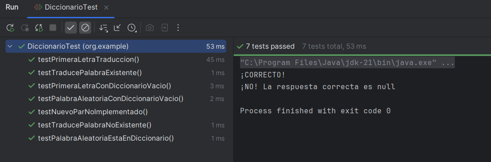

# DiccionarioTest — Pruebas Unitarias con JUnit 5

Proyecto práctico sobre pruebas unitarias en Java utilizando JUnit 5. Se trabaja sobre una clase `Diccionario` que implementa un traductor español-inglés. El objetivo es verificar el comportamiento de todos sus métodos públicos, incluyendo casos normales y casos límite, alcanzando una cobertura mínima del 80%.

## Índice

- [Test 1 — Inserción con nuevoPar](#test-1)
- [Test 2 — Traducción de palabra existente](#test-2)
- [Test 3 — Traducción de palabra no existente](#test-3)
- [Test 4 — Palabra aleatoria pertenece al diccionario](#test-4)
- [Test 5 — Primera letra de la traducción](#test-5)
- [Test 6 — Diccionario vacío: palabrasAleatorias](#test-6)
- [Test 7 — Diccionario vacío: primeraLetraTraduccion](#test-7)
- [Cobertura](#cobertura)

---

## Test 1

> _Comprobar que al llamar a `nuevoPar()` el diccionario no se modifica, documentando que el método está sin implementar._

**Tipo:** Caso normal — método incompleto  

En un proyecto real es habitual encontrar métodos sin implementar. Un test sobre este método documenta su estado actual y fallará automáticamente en cuanto se implemente, recordando al equipo que debe verificar su comportamiento.

**Pasos realizados**

1. Se registra el tamaño del diccionario antes de llamar al método
2. Se llama a `nuevoPar()`
3. Se comprueba que el tamaño sigue siendo el mismo

<details>
<summary>Ver el código</summary>

```java
@Test
public void testNuevoParNoImplementado() {
    int tamanoAntes = Diccionario.map.size();
    Diccionario.nuevoPar();
    int tamanoDespues = Diccionario.map.size();
    assertEquals(tamanoAntes, tamanoDespues);
}
```
</details>

---

## Test 2

> _Verificar que `traduce()` devuelve la traducción correcta cuando la palabra existe en el diccionario._

**Tipo:** Caso normal  
 
Es el comportamiento principal del diccionario. Si este test falla, el programa no cumple su función básica.

**Pasos realizados**

1. Se llama a `traduce("animal", "animal")`
2. Se comprueba que el resultado es `"animal"`

<details>
<summary>Ver el código</summary>

```java
  
@Test
public void testTraducePalabraExistente() {
    String resultado = Diccionario.traduce("animal", "animal");
    assertEquals("animal", resultado);
}
```
</details>

---

## Test 3

> _Comprobar qué devuelve `traduce()` cuando la palabra buscada no existe en el diccionario._

**Tipo:** Caso límite  

Un programa robusto debe gestionar correctamente las entradas inesperadas. Este test verifica que el método devuelve `null` en lugar de lanzar una excepción no controlada.

**Pasos realizados**

1. Se llama a `traduce("xyz", "anything")` con una palabra inexistente
2. Se comprueba que el resultado es `null`

<details>
<summary>Ver código</summary>
  
```java
@Test
public void testTraducePalabraNoExistente() {
    String resultado = Diccionario.traduce("xyz", "anything");
    assertNull(resultado);
}
```
</details>

---

## Test 4

> _Verificar que `palabrasAleatorias()` devuelve una palabra que realmente pertenece al diccionario._

**Tipo:** Caso normal  

El método debe devolver palabras reales del diccionario, no valores inventados o incorrectos. Este test garantiza que la aleatoriedad no compromete la validez de los datos.

**Pasos realizados**

1. Se llama a `palabrasAleatorias()`
2. Se comprueba que la palabra devuelta existe como clave en el diccionario

<details>
<summary>Ver código</summary>
  
```java
@Test
public void testPalabraAleatoriaEstaEnDiccionario() {
    String palabra = Diccionario.palabrasAleatorias();
    assertTrue(Diccionario.map.containsKey(palabra));
}
```
</details>

---

## Test 5

> _Comprobar que `primeraLetraTraduccion()` devuelve la inicial correcta de la traducción en inglés._

**Tipo:** Caso normal  
 
El programa usa esta pista para ayudar al usuario. Si devuelve una letra incorrecta, la experiencia de uso es errónea.

**Pasos realizados**

1. Se llama a `primeraLetraTraduccion("animal")`
2. Se comprueba que devuelve `"a"` (primera letra de "animal" en inglés)

<details>
<summary>Ver código</summary>
  
```java
@Test
public void testPrimeraLetraTraduccion() {
    String letra = Diccionario.primeraLetraTraduccion("animal");
    assertEquals("a", letra);
}
```
</details>

---

## Test 6

> _Verificar que `palabrasAleatorias()` lanza una excepción cuando el diccionario está vacío._

**Tipo:** Caso límite  

Si el diccionario está vacío y se intenta obtener una palabra aleatoria, el programa no puede continuar. Este test verifica que el fallo es detectable y controlable.

**Pasos realizados**

1. Se vacía el diccionario con `map.clear()`
2. Se comprueba que llamar a `palabrasAleatorias()` lanza una excepción

<details>
<summary>Ver código</summary>
  
```java
@Test
public void testPalabraAleatoriaConDiccionarioVacio() {
    Diccionario.map.clear();
    assertThrows(Exception.class, () -> {
        Diccionario.palabrasAleatorias();
    });
}
```
</details>

---

## Test 7

> _Verificar que `primeraLetraTraduccion()` lanza una excepción cuando el diccionario está vacío._

**Tipo:** Caso límite  

Sin palabras en el diccionario no hay traducción posible, por lo que el método no puede extraer ninguna letra. Este test confirma que el fallo es detectable.

**Pasos realizados**

1. Se vacía el diccionario con `map.clear()`
2. Se comprueba que llamar a `primeraLetraTraduccion("animal")` lanza una excepción

<details>
<summary>Ver código</summary>
  
```java
@Test
public void testPrimeraLetraConDiccionarioVacio() {
    Diccionario.map.clear();
    assertThrows(Exception.class, () -> {
        Diccionario.primeraLetraTraduccion("animal");
    });
}
```
</details>

---

## Cobertura

Resultado obtenido con **Run with Coverage**:

- **Clase Diccionario** → Method 85% | Line 97%
- Supera el mínimo requerido del 80%



---

## Tecnologías

- Java 21
- JUnit 5
- Maven
- IntelliJ IDEA


**1º DAW – Entornos de Desarrollo | IES Mutxamel | Curso 2025/2026**  
**Autora:** Manuela Planelles Lucas
